# polyu-agent — PolyU Campus Information Q&A Assistant (Unofficial)

A vertical-domain RAG Q&A project built as a second-stage development on top of [nageoffer/ragent](https://github.com/nageoffer/ragent) (Apache-2.0, baseline pinned to tag **1.1.0**, commit `f64de341`). Delivered scenario: **campus information Q&A for The Hong Kong Polytechnic University** — an assistant for academic registration, library, facility booking, student services, scholarships, key dates and deadlines, with citation traceability and scheduled news updates.

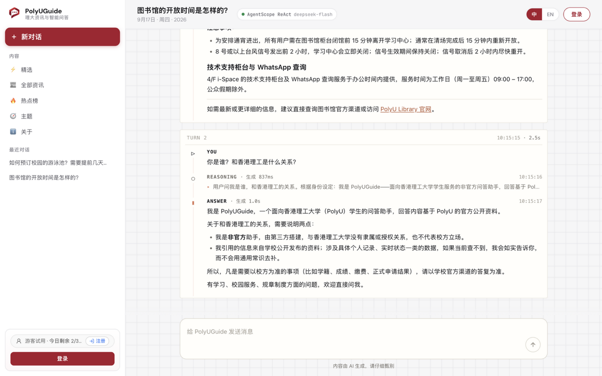

<<<<<<< HEAD
## Important disclaimers
=======
- **混合检索**：向量、关键词、知识图谱、联网搜索并行召回，支持去重、RRF 融合与 Rerank。
- **问题理解**：支持查询词映射、问题重写与拆分、树形意图识别和多知识库路由。
- **模型与工具**：支持模型档位、首包探测、熔断降级，以及 AgentScope 的 MCP 工具发现与调用。
- **会话记忆**：最近 N 轮消息结合持久化摘要，控制 Token 成本并保留关键上下文。
- **流量保护**：Redis 公平排队与分布式并发控制，避免突发请求压垮模型服务。
- **知识闭环**：提供可编排入库 Pipeline、远程刷新、回答溯源、用户反馈、Trace 和管理后台。
>>>>>>> fd58ec76 (refactor(agent-tool): 重构 MCP 工具集成，删除 v2 版本 WorkFlow MCP 相关流程)

- **This is a personal project with no affiliation with The Hong Kong Polytechnic University.** Answers come from public official pages, are for reference only, and the university's official publications always prevail.
- **Official answer data is restricted to public pages that pass the admission rules** (polyu.edu.hk and department sites; robots.txt, access attributes, and terms are checked per host). Content requiring NetID/SSO, authenticated sessions, personalized information, or marked internal/confidential/staff-only never enters the knowledge base; public body text under portal domains is judged by page-level rules.
- Social platforms (Xiaohongshu, Tieba, etc.) are used only as de-identified sources of real demand and for the evaluation set; community answers are not ground truth. Links to community questions may be provided later, kept separate from official answers — posts are never copied.
- This project is a second-stage development on an open-source base, not built from scratch. Base capabilities (hybrid retrieval engine, ingestion pipeline, model routing and fault tolerance, admin console) come from nageoffer/ragent — see the upstream repository for full base documentation. The downstream work concentrates on **business-domain content engineering, retrieval-pipeline localization, and multilingual support**. The upstream `main` branch is evolving toward 2.0; this project does not follow it wholesale (upstream fixes are cherry-picked on demand — see the cherry-pick footnotes in commit history). The lineage stays pinned to the 1.1.0 baseline and retains its Apache-2.0 license ([LICENSE](./LICENSE)).

## The problem it solves

PolyU information is scattered across dozens of department sites (Academic Registry, Student Affairs Office, Pao Yue-kong Library, ITS, …). Students trying to figure out "how do I book the swimming pool", "how does the library printer work", or "how does Add/Drop work" end up digging through multiple documents — or asking experienced seniors on Xiaohongshu. This project aggregates the public information into a **RAG Q&A with citation traceability**:

| Capability | Description |
| --- | --- |
| Domain-partitioned Q&A | knowledge bases partitioned by department/scenario + intent-tree routing (registration / library / facilities / student services / scholarships / exchange …) |
| Citation traceability | inline citation markers + sources panel + official-page preview; the agentic tool block carries a collapsible "N sources" badge (document name + excerpt + jump-to-original) |
| Scheduled refresh | URL-sourced documents refreshed incrementally on cron (native to the base); news feed: scheduled discovery of official/university channels → bilingual AI summaries and classification → feed / trending / topic browsing; global search with sort direction and category scope (feature-flag gated) |
| Multilingual | simplified Chinese and English officially supported at launch; trilingual document identity and cross-lingual retrieval retained underneath; traditional Chinese is compatibility-smoke-tested only for now |
| Feedback & about | anonymous feedback (daily IP limit) with back-office management; about page with markdown editing and a tip jar (feature-flag gated) |
| Real-demand loop | social-media questions feed the golden set and colloquial query forms; failed online questions keep only de-identified scenario + diagnostics and asynchronously produce knowledge-gap reports |

## Interface preview

The live site [polyuguide.com](https://polyuguide.com) can be tried as a guest without registration (daily quota). Click the "N sources" badge in an answer to expand document names, excerpts, and links to the original official pages.

**News feed (Chinese)** — bilingual AI summary cards, category filters, and the daily trending board:

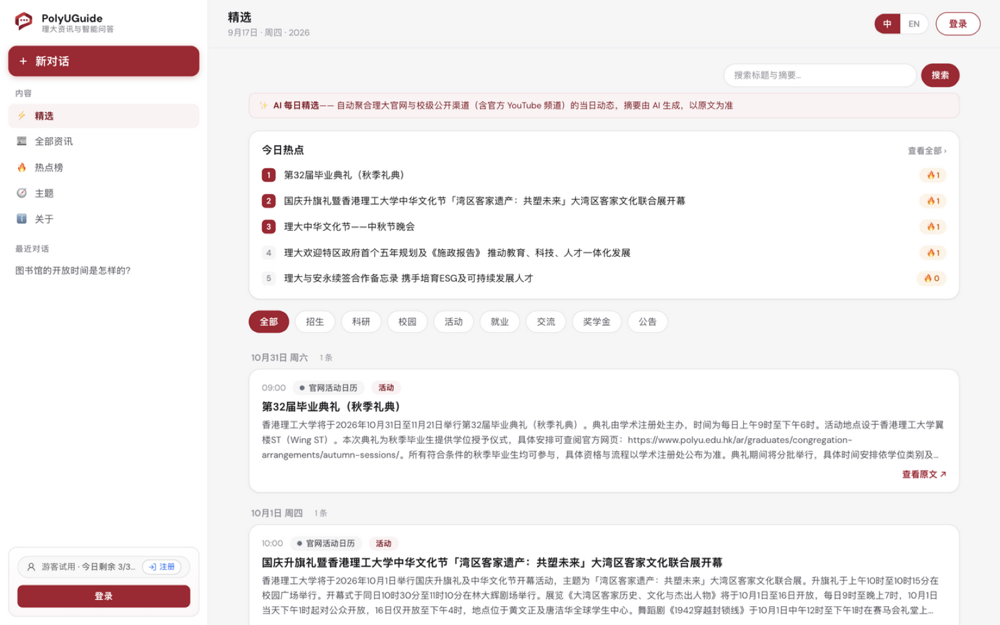

**English UI** — one-click language switching:

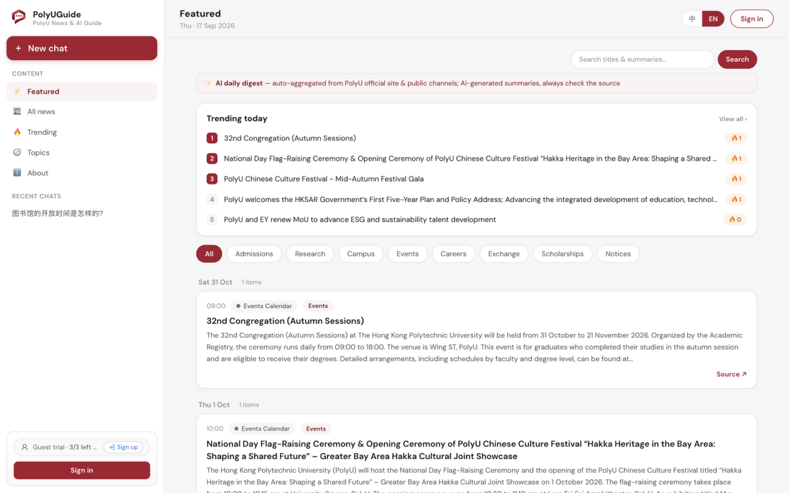

**About page** — project statement, unofficial disclaimer, and feedback channel:

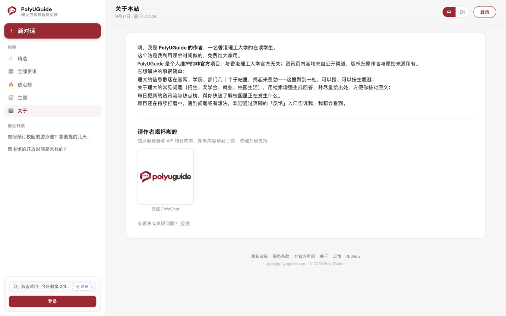

## Repository layout

- `bootstrap/` — Spring Boot startup module (main configuration, production profile, application assembly)
- `framework/` / `infra-ai/` — base framework layer and AI infrastructure (model routing, middleware adapters, shared plumbing)
- `rag/` — retrieval domain (knowledge bases and ingestion, intent tree, query rewriting, evaluation, news fetching and heat ranking)
- `agent/` — agentic Q&A chain (ReAct, confirmation cards, tracing)
- `mcp-server/` — MCP tool service (sample tools)
- `system/` — users, auth, audit, data retention and other system concerns
- `frontend/` — React frontend (Vite + zustand + Tailwind)
- `resources/` — schema SQL and incremental upgrades, knowledge corpus, demo initializers, local middleware compose
- `deploy/` — production deployment (images, compose orchestration, gateway config, deployment guide)
- `docs/` — base documentation (architecture diagrams, release notes, samples)

## Quick start

Environment and startup follow the upstream documentation and defaults ([nageoffer/ragent](https://github.com/nageoffer/ragent) README, `bootstrap/src/main/resources/application.yaml`). Runtime file storage reuses a private S3-compatible store on the same host (MinIO) instead of a managed object-storage service. Retrieval uses fused pgvector semantic + Elasticsearch keyword channels (ES 9.4.2 + IK, enabled after lexical retrieval passed measured acceptance, with an overall rollback switch kept); Milvus / LightRAG stay off by default. For production deployment (container images, single-host orchestration, deploy pipeline) see [deploy/README.md](./deploy/README.md).

## Current status

The site is live and running (https://polyuguide.com). Main capabilities:

- **Knowledge base**: official-source corpus crawling, parsing, ingestion, and storage/retrieval consistency reconciliation — 280+ official sources in the library (including multilingual versions); chunk sizing frozen by evaluation
- **Retrieval**: fused pgvector + Elasticsearch (IK) dual channel with the rollback switch retained; the evaluation set (human-reviewed core questions + lexical-retrieval challenge questions) is maintained continuously
- **Q&A**: multi-model chat routing (primary + failover + circuit-breaker self-healing), scenario-based bilingual prompts, intent-tree routing, no-answer refusal and stale-citation control
- **News feed**: multi-type fetchers (sitemap / RSS / JSON API / HTML list) + heat model + topic clustering, scheduled incremental updates (feature-flag controlled)
- **Accounts**: email registration/verification with a required unique username, dual-channel login (username or email), self-service account center (change email with re-verification, change password, my-shares management), account deletion (with cooling-off recovery), anonymous-trial quota, public answer sharing (immutable snapshots) — feature-flag controlled per deployment (sharing defaults on, issue #124 unified flag)
- **Site copy**: privacy notice / terms of service / unofficial disclaimer permanently in the footer; the privacy notice discloses third-party model transmission and data-retention periods
- **Mobile**: 375–430px chat main flow usable (sources panel drawer, etc.); full adaptation is a later iteration
- **Security**: bcrypt password hashing with transparent upgrade of legacy entries, server-side role checks on admin endpoints with write-action audit logs, login rate limiting and lockout, automated data-retention cleanup, single-domain CORS allowlist, SSRF guards on uploaded document sources, gateway-layer response-header hardening
- **Engineering**: CI gates (backend quality gate / frontend lint+test+build / dependency patrol / gitleaks full-history secret scanning / CodeQL / image vulnerability scanning / dependency audit) and the production deploy pipeline

## Roadmap

- **Near term**: launch load test; enable anonymous trial and open registration (feature flags)
- **Corpus expansion**: from launch high-value sources toward full-site mechanisms

  | Dimension | Launch target |
  | --- | --- |
  | Knowledge corpus | 100–300 high-value official sources (high-frequency question domains first); full-site expansion is a later mechanism |
  | Intent tree | from 3 domains / 10–15 intents at the evaluation baseline toward 15–25 intents |
  | Evaluation set | 30–60 human-reviewed core questions + ~20 lexical-retrieval challenge questions, later expanding to 80–100 |

<<<<<<< HEAD
- **News feed GA**: scheduled discovery → automatic classification → feed display
- **i18n**: official traditional-Chinese support
- **Stretch**: calendar/deadline MCP tools, a LightRAG graph channel, and — subject to compliance and feedback — evaluating contact with the university
=======
**说白了，学 AI 项目的核心原因就三个：**

1. **简历差异化**。同样是后端开发，有 AI 项目经验的简历通过率明显更高。不是因为 AI 多神奇，而是它能证明你不只是在重复造轮子。
2. **面试有东西聊**。AI 项目涉及的技术栈足够深——Embedding、向量数据库、Prompt 工程、模型调用链路、检索策略……每一个点都能展开聊，比我用了 Redis 做缓存有意思得多。
3. **实际工作用得上**。AI 不是实验室里的玩具，企业已经在大规模落地了。现在学，是为了接下来三到五年的职业发展铺路。

### 3. 问题是，怎么学？

很多人跟着 B 站视频或者 GitHub 上的开源项目撸了一遍，以为自己懂了。结果面试一问深的，直接懵了。原因很简单：那些 Demo 级别的项目，和企业真正要用的东西，差距太大了。

还有些同学报了训练营，发现清一色是 Python。语言不熟、生态不通，学完感觉收获有限，回到 Java 这边还是不知道怎么下手。就算用 Spring AI 或者 LangChain4j，版本迭代太快，低版本功能缺，高版本升级约等于重写，也是一肚子苦水。

基于这些问题，我决定做一个 Agentic RAG 实战项目，名字叫 **Ragent**。

这个项目覆盖 RAG 全链路和 Agent 智能体两条主线，同时涉及 MCP/Skills 集成。更重要的是，它不是我看了几篇文章拼凑出来的玩具——我在公司**实际落地过 Agentic RAG 系统**，解决过信息孤岛、知识检索、效率提升这些真实的业务问题。所以 Ragent 的复杂度，就是企业级项目该有的复杂度。

学完之后，你可以放心大胆地跟面试官讲：**企业里就是这么做的**。

## ⚠️ RAG 常见误区

市面上打着 RAG 旗号的项目不少，但很多要么是玩具级 Demo，要么是概念包装。在学之前，先把这几个误区理清楚，避免踩坑。

常规 RAG 的流程如下：

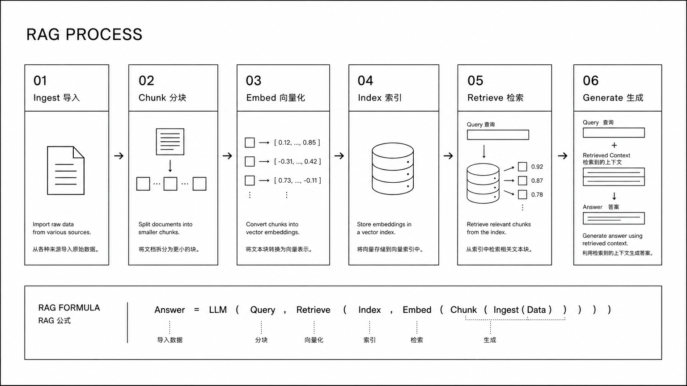

<b>4 个常见误区详解</b>（点击展开）

### 1. 调个 API 就算会 RAG 了

很多教程的套路是：调一下 OpenAI 的 Embedding 接口，往向量数据库里塞点数据，再用 LLM 生成答案——完事了。这顶多算跑通了一个 Demo，离会 RAG 差得远。

真正的 RAG 系统要考虑的问题多得多：文档怎么切分效果最好？检索召回率不够怎么办？多路召回怎么融合排序？幻觉怎么控制？这些才是面试官会追问的点。

跑通 Demo 和做出能上线的系统之间，差的不是代码量，是对每个环节的深入理解。

### 2. RAG 就是“检索 + 生成”两步走

`Retrieval-Augmented Generation` 这个名字确实容易让人觉得就是检索加生成。但实际工程中，一个能用的 RAG 系统至少涉及这些环节：

- **数据处理**：PDF、Word、PPT、网页，格式五花八门，光是解析成干净文本就是一堆脏活。PDF 里的表格、扫描件、双栏排版，每一个都是坑。
- **分块策略**：切太大检索不精准，切太小上下文丢失。按段落切、按固定字数切、按语义切，不同文档可能需要不同策略。
- **问题重写**：用户问“报销咋整”，你拿这四个字去检索，效果能好吗？多轮对话里用户说“怎么申请”，不补上下文系统根本不知道在问啥。
- **意图识别**：用户是想查知识库，还是要调用业务系统？是闲聊还是正经提问？走错了路，答案肯定不对。
- **检索策略**：纯向量检索对精确匹配很弱，用户问一个订单号，向量检索可能完全找不到。混合检索怎么融合、top-k 选多少、要不要重排序，都是取舍。
- **会话记忆**：20 轮对话全塞给模型？Token 成本扛不住。只带最近几轮？可能丢关键上下文。记忆的压缩、摘要、持久化，又是一套单独的机制。

每一环都有坑，每一环都值得深挖。面试的时候能把这些讲清楚，比背概念有用得多。

### 3. 用 OpenAI/LangChain 套一套就是企业级

OpenAI/LangChain 是个好工具，但直接拿来套壳不等于企业级。企业场景下要面对的是：

- 大规模文档的增量更新，不可能每次全量重建索引
- 多租户隔离和权限控制，不同部门看到的知识库不一样
- 高并发下的检索性能，模型调用的成本控制和容错
- 请求风控，防止用户套取敏感信息或恶意攻击
- 模型负载均衡，多供应商切换和降级策略
- 可观测性，效果监控和用户反馈收集

这些问题 OpenAI/LangChain 的 QuickStart 不会告诉你，但面试官和实际业务一定会考你。

### 4. 只关注模型，忽略工程能力

RAG 项目的核心竞争力不在于你用了多强的模型，而在于工程化能力。同样的模型，检索策略不同、Prompt 设计不同、分块粒度不同，最终效果可以天差地别。

举个例子：用户问“打印机墨盒怎么换”，文档里写的是“墨盒更换步骤”。关键词搜索直接匹配不上，但向量检索能理解它们是一回事。这背后是 Embedding 模型的选型、向量数据库的调优、检索结果的重排序——每一步都是工程决策，不是换个更贵的模型就能解决的。

面试中能把这些工程细节讲清楚的人，远比只会说"我用了 GPT-4"的人有说服力。

## 🏗️ Ragent 核心设计

采用前后端分离的模块化单体架构，后端按职责分为七个 Maven 模块：

| 模块 | 职责                                                                                 |
|:---|:-------------------------------------------------------------------------------------|
| `infra-ai` | Chat / Embedding / Rerank / VLM 模型客户端、模型档位、路由、首包探测、健康状态与降级 |
| `system` | 用户认证与审计日志，位于各业务引擎之下的系统支撑域                                   |
| `rag` | RAG 问答、知识库、入库 Pipeline、意图树、检索、会话及管理端 API                      |
| `agent` | AgentScope ReAct 执行引擎，接入知识检索与 MCP 工具，支持技能、记忆和人工确认                             |
| `bootstrap` | 启动装配层，仅含启动类与主配置                                                       |
| `framework` | 统一响应与异常、幂等、分布式 ID、MQ 适配、SSE 与跨节点流式取消等基础能力             |
| `mcp-server` | 基于 MCP Java SDK 的独立工具示例服务，内置天气、票务、销售与联网搜索示例             |

这个分层不是为了炫技，而是把业务编排、AI 供应商差异和通用基础设施隔离开。切换模型、向量库或对象存储时，核心问答流程不需要跟着重写。

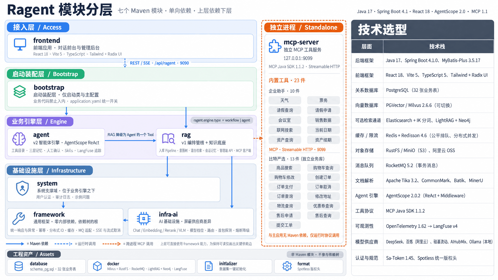

一次提问在服务里怎么走，v1 和 v2 是两套路子。

MCP 客户端只在 `agent` 模块中装配，使用 AgentScope 连接和发现工具，服务地址配置在 `agent.mcp.servers`。意图树中的 MCP 节点仍指定可用工具及确认规则；Workflow 只识别知识库和系统意图，不连接 MCP 服务。`mcp-server` 是独立示例服务，使用与 AgentScope 一致的 MCP Java SDK 版本实现服务端协议。

- v1 是 Workflow 编排，路径写死在代码里：问题重写、意图识别、多路召回、组装生成，一步接一步走完。
- v2 换成 Agentic 架构，路径由模型自己定：知识检索、MCP 工具和 Skills 技能都变成它手里的工具，查不查、查几次、查完接着干什么，在 ReAct 循环里边推理边决定。所以链路比 v1 长，也不再是一条直线。

> 下图是 v2 的核心流程。实际项目代码中的逻辑比图上更复杂，落地过程中还涉及很多细节和优化。

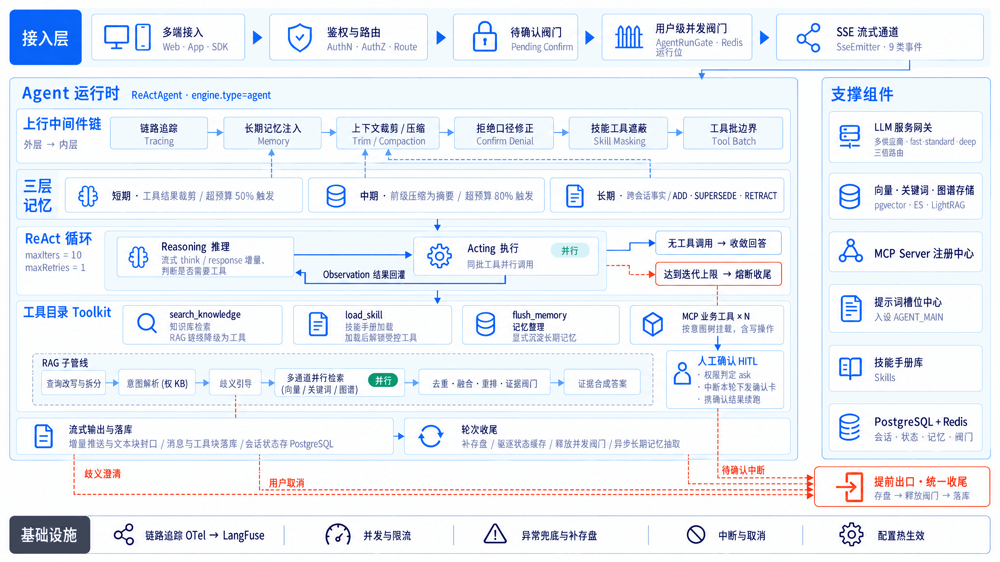

两套并存，不是谁替代谁。问答类知识助手需求走 v1 更快也更可控，要规划、要动手操作的场景才交给 v2。

## ✨ 项目质量怎么样？

这里的质量不靠一张架构图来证明，而是看代码边界、测试、故障处理和运维闭环是否真实存在。以下数据按当前仓库统计，代码行数包含注释和空行。

### 1. 规模与完整度

- **后端**：7 个 Maven 模块，分别承载基础能力、知识库问答、Agent、启动装配和示例 MCP 服务。
- **前端**：知识库管理、意图树、Agent 技能、会话与系统配置。
- **数据与测试**：平台业务表与 `mcp-server` 演示业务表分别维护，Java 测试覆盖检索、Agent 工具调用和服务端协议。

代码量本身不等于质量，但这些模块组成了数据进入系统—检索生成答案—展示证据—收集反馈—追踪与审计的完整闭环，另有 Agent ReAct 推理与工具调用链路，不仅是简单的 API 示例。

### 2. 工程质量

- **模块边界**：通用基础设施、AI 能力、RAG 业务、Agent 引擎和 MCP 服务相互隔离，替换模型或存储实现不会侵入问答编排。
- **配置防错**：模型档位、候选能力和检索漏斗在启动阶段完成一致性校验，错误配置直接失败而不是静默降质。
- **并发治理**：10 个专用线程池隔离负载，TTL 保证用户与 Trace 上下文跨线程传递。
- **关键路径测试**：覆盖模型路由、检索预算、会话摘要、入库 Pipeline、MCP 和 Agent 上下文与长期记忆。
- **工程约束**：统一响应、错误码和异常处理，认证、幂等、线程安全 SSE 与 Spotless 格式化均已落到代码。

> 项目中大量应用并发线程，建议配合社群里的 [oneThread 动态线程池框架](https://nageoffer.com/onethread) 搭配学习收获更多。

### 3. 代码是怎么组织的

AI 写代码很强，但掌舵的还是程序员。能不能接着扩展、改一处会不会牵一片，取决于动手前有没有把结构定好。项目里的设计模式，每个都对着一个具体问题：

| 设计方式 | 业务场景 | 解决的问题 |
|:---|:---|:---|
| 策略 | 检索通道、结果后处理、文档来源 | 不同实现可独立替换 |
| 工厂 | 意图树、分块策略、流式回调创建 | 集中复杂对象的创建逻辑 |
| 模板方法 | 并行检索、模型请求 | 固定通用流程，仅开放差异步骤 |
| 注册表 | 意图节点管理 | 统一注册和查找配置 |
| 装饰器 | 向量写入时同步关键词和图谱索引 | 在不修改主流程的前提下增强能力 |
| 责任链 | 检索后处理、模型故障降级 | 按顺序组合处理步骤 |
| 中间件 | Agent 记忆注入、上下文压缩、技能遮蔽、工具批处理 | 不改执行引擎就能插拔能力 |
| 适配器 | 多家模型方言、Agent MCP 业务规则、MQ 客户端 | 屏蔽外部接口差异 |
| 状态机 | 远程文档定时刷新 | 约束状态流转，挡住非法跳转 |
| 事件回调 | 模型流式响应、首包探测、SSE 输出 | 解耦事件生产与消费 |
| AOP | 链路追踪、幂等、审计日志 | 将横切逻辑与业务解耦 |

下一节的那些扩展点，基本都是这些模式带来的结果。

### 4. 可扩展性

核心能力通过接口、注册表和配置隔离，新增实现可以复用现有编排、容错、日志和管理能力：

| 扩展维度 | 如何接入 | 接入后的效果 |
|:---|:---|:---|
| 模型 | 实现 `ChatClient` / `EmbeddingClient` / `RerankClient`，加入模型候选配置 | 新供应商可进入模型档位与候选路由，复用首包探测、健康检查和熔断降级 |
| 存储 | 实现向量存取或 `ObjectStorageClient`，通过配置选择实现 | 可替换向量库或对象存储，知识入库与问答主流程保持不变 |
| 检索 | 实现 `SearchChannel` 或后处理器，注册为 Spring Bean 并设置顺序 | 新通道参与并行召回，新处理器可插入去重、融合、精排与富化链路 |
| 入库 | 实现 `IngestionNode` 或 `DocumentFetcher`，补充节点类型和配置 | 新处理步骤或文档来源进入 Pipeline，继续使用任务状态、节点日志和失败定位 |
| Agent | 新建人设与技能手册，或注册新的中间件 | 新智能体复用 ReAct 循环、记忆与人工确认，不必改动执行引擎 |
| MCP | 暴露 MCP 工具规范，在 `agent.mcp.servers` 配置外部 MCP Server | AgentScope 发现工具并将服务端 Schema 提供给模型 |

扩展的改动主要收敛在新实现和配置中，不必复制一套检索、会话或 Trace 主链路。

### 5. 生产级特性

这里的生产级特性指项目已经实现生产环境会遇到的关键机制，而不只是功能能跑：

| 特性 | 说明                                                                              |
|:---|:----------------------------------------------------------------------------------|
| **流量保护** | Redis ZSET 公平排队，结合 Lua 原子抢占、过期信号量和 Pub/Sub 唤醒                 |
| **模型容错** | 多候选模型自动切换，首包超时、空响应或异常时触发降级；三态熔断隔离故障节点        |
| **检索稳定性** | 多通道并行检索，单通道失败不影响主链；按召回、Rerank、TopK 分层控制检索规模       |
| **数据一致性** | RocketMQ 事务消息保障分块可靠执行；支持幂等，远程刷新使用分布式锁和状态机         |
| **可观测与审计** | 记录 Trace Run / Node 的耗时、输入输出和异常；管理端提供趋势、详情及配置变更 Diff |
| **流式体验** | SSE 分事件输出思考、正文、来源和推荐问题；支持全局超时及客户端断开取消            |
| **会话与证据** | 消息持久化和摘要控制上下文；保存引用来源，支持原文预览、追问和反馈                |
| **Agent 执行保障** | 上下文按水位裁剪与压缩，长期记忆跨会话沉淀；写操作可配置人工确认，支持执行中断    |
| **安全基础** | Sa-Token 认证、数据归属校验、上传限流、参数校验和统一异常处理                     |

### 6. 完整控制台

Ragent 提供覆盖**普通用户与管理员用户**的 React 控制台，不只是聊天页面，也把检索证据和运维入口暴露出来。

系统通过多轮 AI 辅助设计优化，在保证功能完整性的同时，提供更加现代化和友好的交互体验。

#### 6.1 用户问答界面

v2 面向 Agent 任务提供完整的执行过程视图。模型思考、工具调用、并行批次和最终回答会按时间线实时展开，任务做了什么、耗时多久都能直接看到。

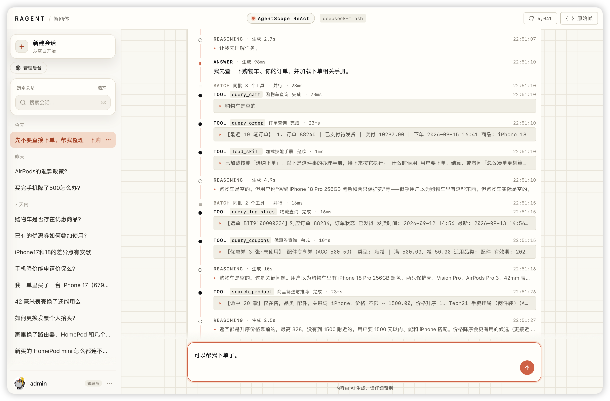

遇到下单、修改数据等写操作时，系统会先展示操作内容和原始参数，用户确认后才会继续执行。

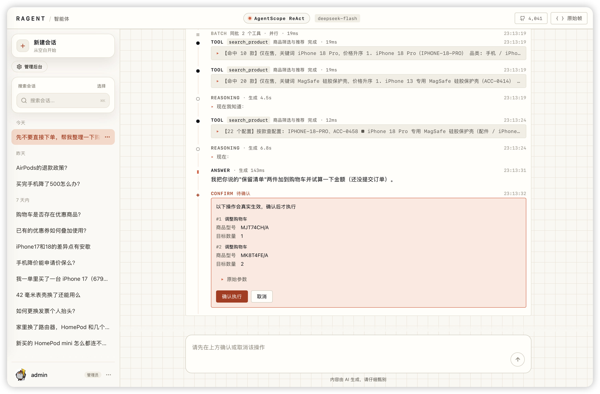

v1 保留更轻量的知识问答界面，适合检索路径固定、以答案和引用为主的场景。用户可以直接输入问题，也可以通过示例问题快速体验，并按需开启**深度思考模式**。

- 支持自然语言输入
- 支持示例问题快速填充
- 支持深度思考模式

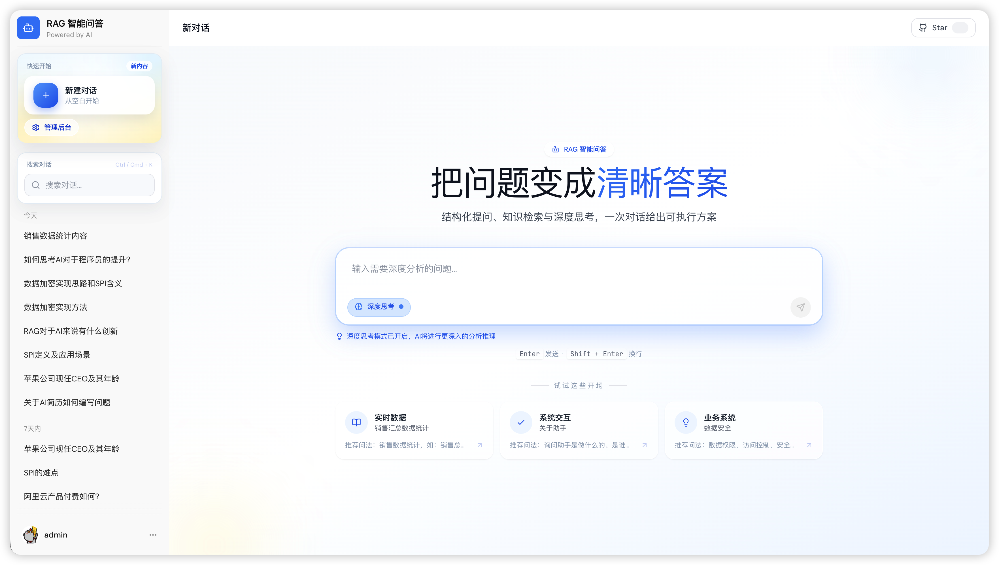

用户提交问题后，模型会实时生成回答结果，并提供良好的阅读体验：

- 支持 Markdown 格式渲染
- 支持图片内容展示
- 支持代码高亮显示
- 支持回答来源、原文预览和推荐追问
- 支持回答评价（点赞 / 点踩）

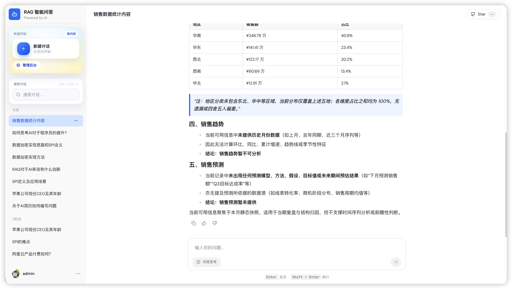

#### 6.2 管理后台

管理员可以通过后台查看仪表盘，管理知识库与 Chunk、知识图谱、意图树、查询词映射、入库任务、示例问题、用户和系统设置，并查看 RAG Trace 与业务变更日志。

<b>管理后台界面截图</b>（点击展开）

v2 新增 Agent 运行概览，集中展示活跃会话、工具调用成功率、人工确认和上下文压缩等指标，运行状态和问题分布可以直接查看。

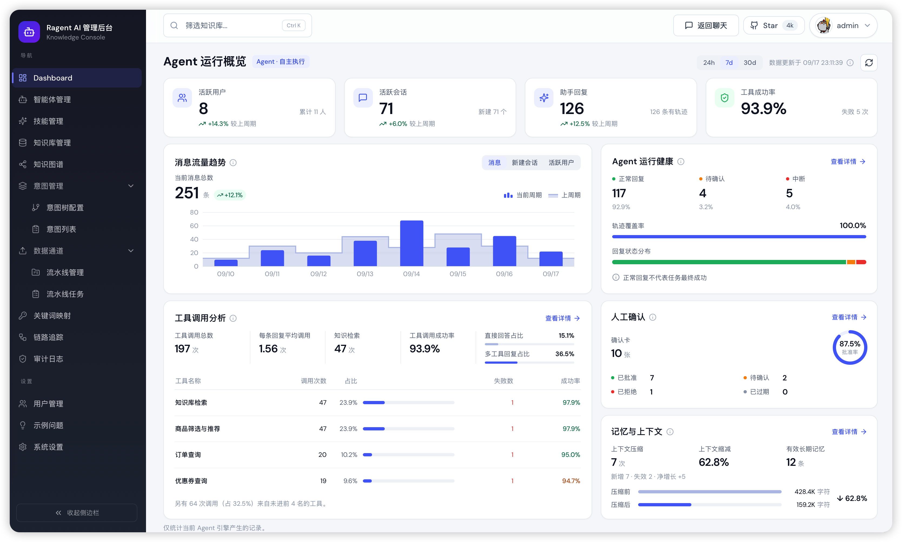

同时接入 Langfuse，可按会话查看模型推理、工具调用、耗时与 Token 消耗，方便定位 Agent 链路中的具体问题。

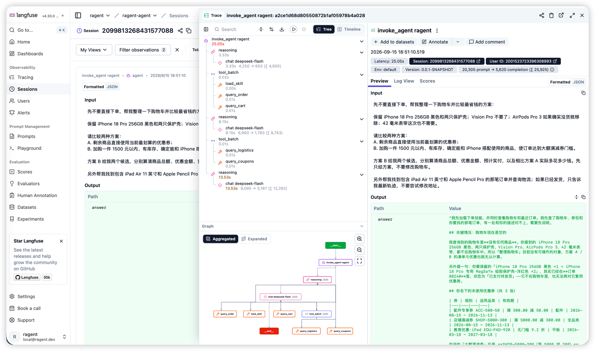

v1 管理后台侧重 RAG 配置和运行管理，覆盖模型、知识库、数据集、Trace 等常用功能。

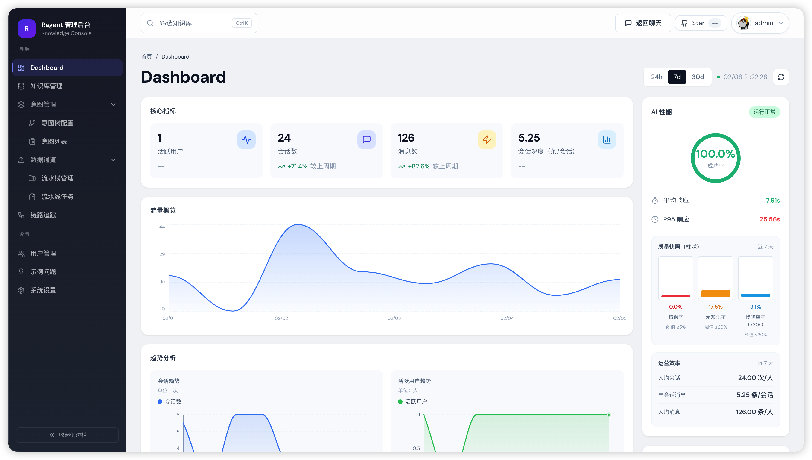

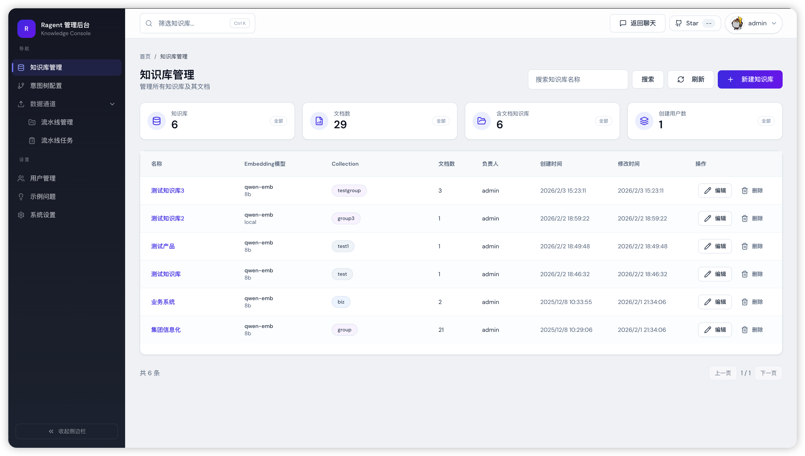

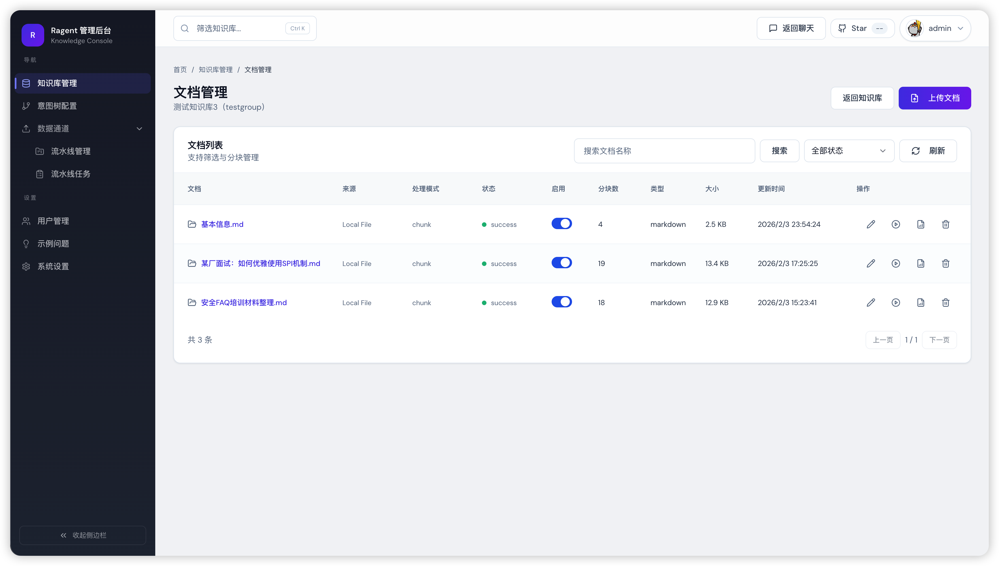

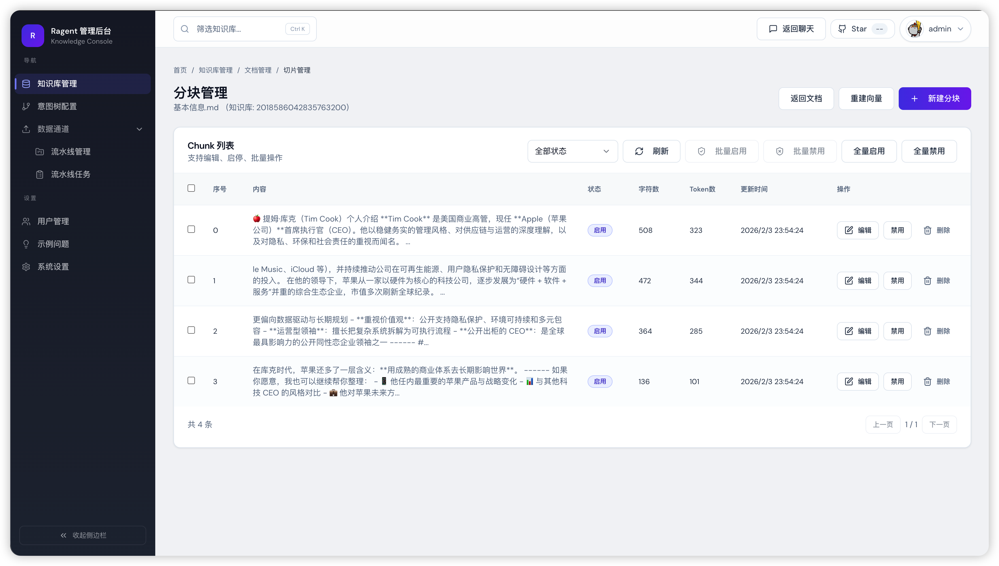

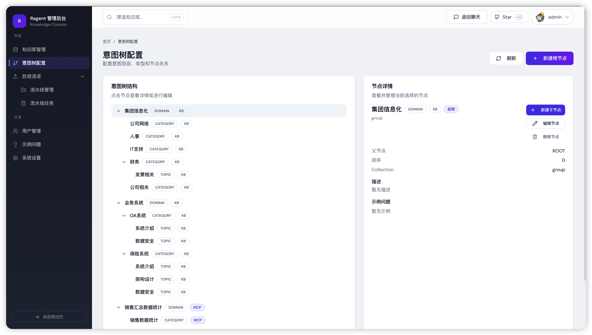

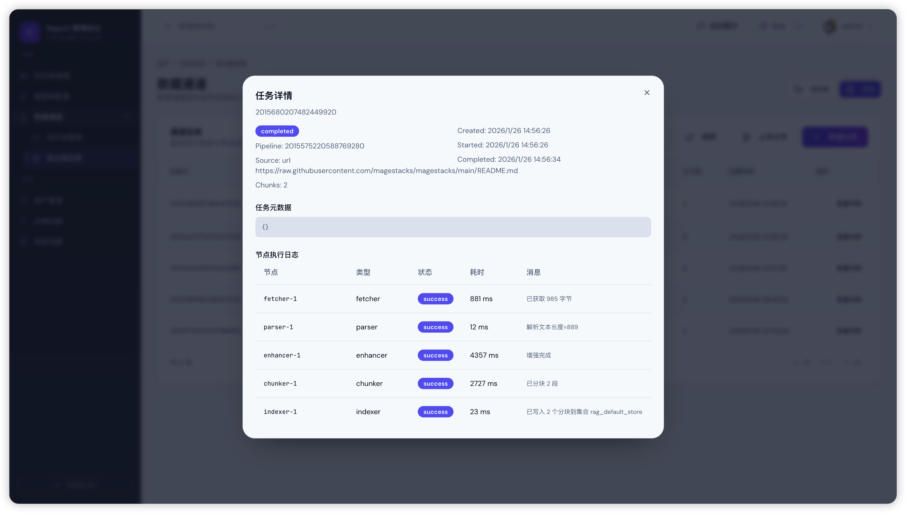

控制台围绕实际使用和排障流程持续打磨，在功能完整的基础上，尽量把复杂能力做得直观、易用。

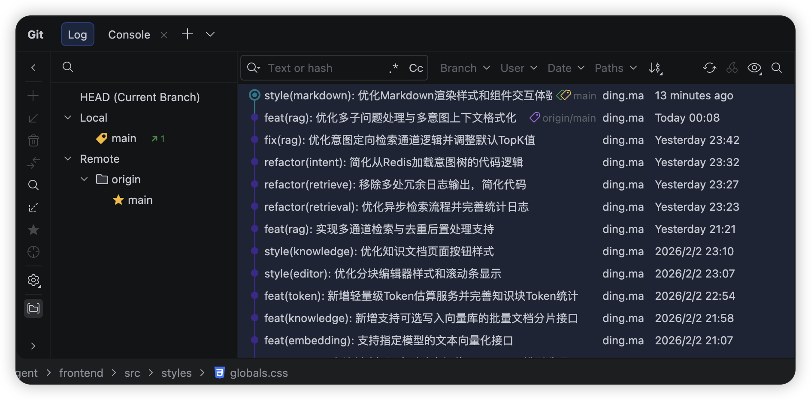

### 7. 和市面上项目的区别

Ragent 定位于 **Java AI 应用的源码级工程参考**，重点是完整链路、生产保障和二次开发能力。

| 对比维度 | 常见 RAG 教程 / Demo | Ragent                                                 |
|:---|:-----------------|:-------------------------------------------------------|
| 项目定位 | 跑通检索与生成          | 完整 Java Agentic RAG 应用                             |
| 检索 | 单路向量 TopK        | 向量 / 关键词 / 图谱 / 联网召回，RRF 融合与 Rerank     |
| 问题理解 | 原问题直接检索          | 查询词映射、问题重写与拆分、树形意图和多知识库路由     |
| 模型调用 | 单模型直连            | 模型档位、首包探测与熔断降级                           |
| 工具接入 | 以应用内函数调用为主 | MCP 协议、远程工具发现、Schema 校验与写操作人工确认    |
| 智能体 | 无或单轮函数调用 | ReAct 多轮推理、技能体系、执行中断与恢复               |
| 知识入库 | 一次性脚本            | 可编排 Pipeline、节点日志、远程文档定时刷新            |
| 会话记忆 | 以近期消息拼接为主 | 最近 N 轮消息 + 持久化摘要；Agent 侧三层上下文管理     |
| 回答可信度 | 只展示答案            | 来源引用、原文预览与用户反馈                           |
| 运行保障 | 基础日志             | 分布式限流、幂等、事务消息、Trace 与审计               |
| 监控指标 | 通用调用量与耗时 | 基于 LangFuse 提供个性化指标，覆盖链路质量、工具调用等 |
| 二次开发 | 流程写死             | 模型、存储、检索、入库和 MCP 均提供扩展接口            |
| 管理能力 | 无或简单页面           | 完整用户端与管理后台                                   |

## ❓ 常见问题答疑

一句话：学完 Ragent，你既能跟面试官聊 RAG/Agent 的技术深度，也能证明自己的 Java 工程化水平。

<b>能学到什么 / 适合谁？</b>（点击展开）

### 1. 能够学到什么？

Ragent 不只是教你调 API，而是让你理解一个 Agentic RAG 系统从 0 到 1 落地的全过程。粗略来说，你能收获这些：

- **RAG 全链路工程能力**：文档解析、分块策略、Embedding 向量化、意图识别、问题重写与拆分、多路检索、重排序、Prompt 组装、流式生成，每个环节怎么做、为什么这么做。
- **Agent 智能体实战**：ReAct 执行引擎、MCP 工具调用、技能体系、三层上下文记忆、人工确认，这些是 AI 应用区别于传统 CRUD 系统的核心能力。
- **模型工程化实践**：模型档位、多候选路由、首包探测、熔断降级，解决模型不稳定时如何保障服务可用性。
- **高质量 Java 工程能力**：分层架构、设计模式实战、分布式并发限流、多线程池管理与上下文透传、全链路追踪，这些能力不局限于 AI 项目，放到任何 Java 后端岗位都是加分项。
- **前后端完整项目经验**：后端 Spring Boot 4 + 前端 React 18，从 API 设计到页面交互，完整的全栈项目经历。

### 2. 适合人群

**校招同学：**

- **Java 后端方向的在校生**：简历上已经有了商城、外卖等常规项目，需要一个有区分度的项目来拉开差距。Ragent 能让你在面试中聊 AI + 工程化，而不是千篇一律的 CRUD。
- **想转 AI 应用方向的同学**：对大模型感兴趣，但不想从 Python 和算法入手。Ragent 基于 Java 技术栈，学习曲线平滑，不需要额外切换语言生态。
- **准备实习/秋招/春招的同学**：大厂校招越来越看重候选人对新技术的敏感度，简历上有 AI 项目经验，能直接证明你的学习能力和技术视野。

**社招同学：**

- **1-3 年经验的 Java 开发**：日常写业务代码，想往 AI 方向转型但不知道从哪下手。Ragent 的技术栈你都熟悉，学的是 AI 应用层的东西，上手快、能落地。
- **3-5 年经验的后端开发**：技术能力不差，但面试被问到 AI 相关问题答不上来，少了一个谈薪筹码。通过 Ragent 补上 RAG、Agent、MCP 这些知识点，面试时能聊得有深度。
- **想跳槽到 AI 团队的开发者**：越来越多的 JD 要求有 AI 相关经验，Ragent 能帮你快速建立 RAG 系统的全局认知，面试时不再只是纸上谈兵。

## 🌟 为什么开源？

原因很简单：**对项目质量足够自信**。架构设计、代码实现、工程规范，每一行都经得起审视。好不好你 clone 下来自己看——目录结构、提交记录、注释规范，全是明牌。

<b>开源背景与价值</b>（点击展开）

之前做拿个 offer 社群时，第一个业务系统 12306 选择了开源，收获了

，也得到了很多同学的认可和信任。这次 Ragent 作为社群在 AI 领域的第一个项目，同样选择开源——既然代码质量经得起检验，就没必要藏着掖着。

市面上不少项目只敢放几张截图、讲几个概念，真正敢把代码全部摊开的并不多。Ragent 敢这么做，是因为前面讲的那些能力——多路检索、意图识别、模型容错、全链路追踪——不是 PPT 里的架构图，是你能跑起来、能断点调试、能逐行阅读的真实代码。

开源对你来说意味着什么：

- **源码即文档**：想了解某个模块怎么实现的，直接翻代码，比任何教程都准确、都及时。
- **本地可调试**：断点打到任意一行，跟着一次请求走完整个 RAG 链路，比看架构图理解得深十倍。
- **可参与贡献**：发现 Bug 提 Issue，有优化思路提 PR。参与一个企业级 AI 开源项目，本身就是简历上的亮点。
- **持续迭代更新**：项目会持续演进，Star 和 Watch 之后能第一时间获取新特性。

  <a href="https://www.star-history.com/?repos=nageoffer%2Fragent&type=date&legend=top-left">
    <picture>
      <source media="(prefers-color-scheme: dark)" srcset="https://api.star-history.com/image?repos=nageoffer/ragent&type=date&theme=dark&legend=top-left" />
      <source media="(prefers-color-scheme: light)" srcset="https://api.star-history.com/image?repos=nageoffer/ragent&type=date&legend=top-left" />
      
    </picture>
  </a>

如果屏幕前的亦菲/彦祖觉得项目还不错，点个 Star 支持一下，这是对开源作者最好的认可！
>>>>>>> fd58ec76 (refactor(agent-tool): 重构 MCP 工具集成，删除 v2 版本 WorkFlow MCP 相关流程)
